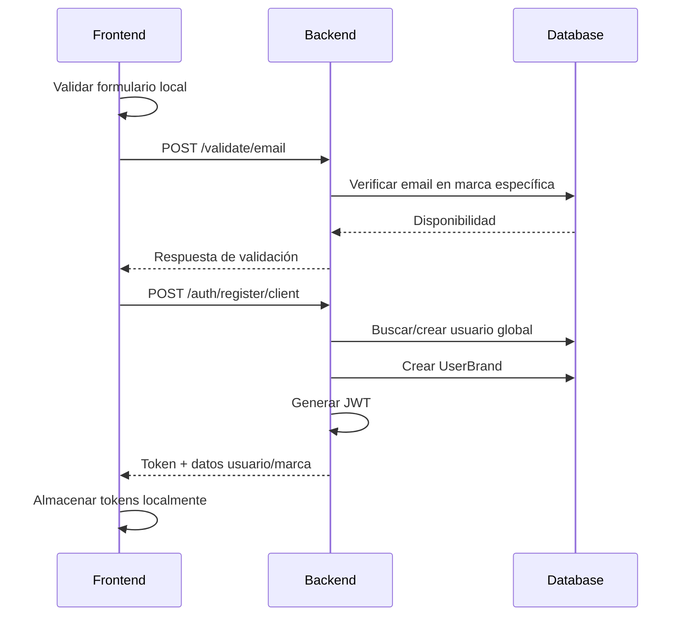
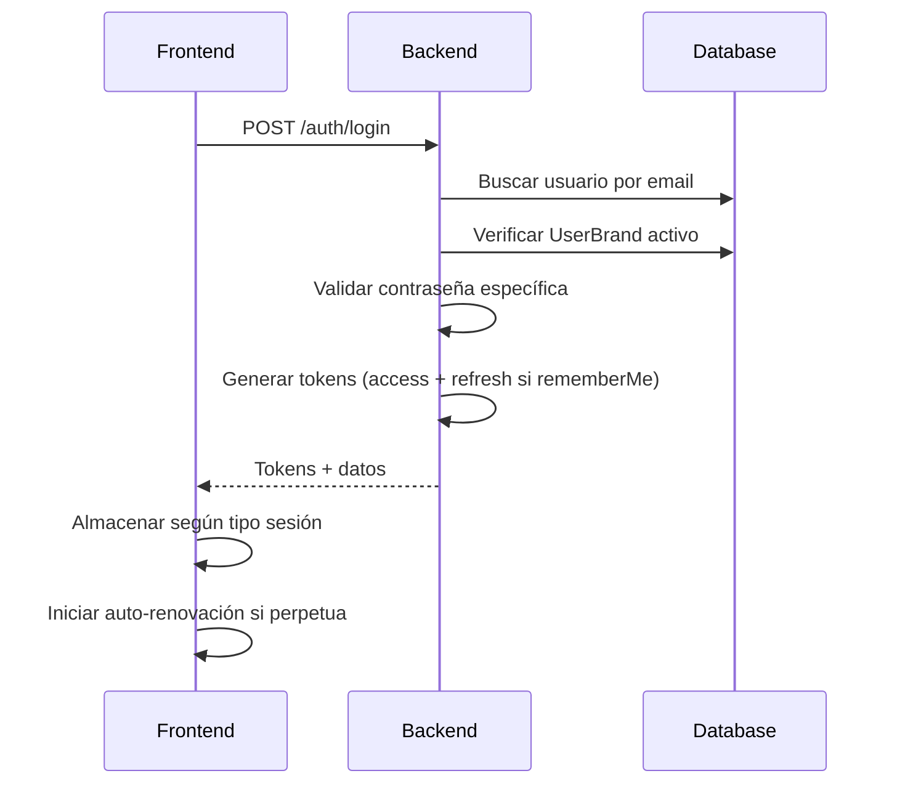
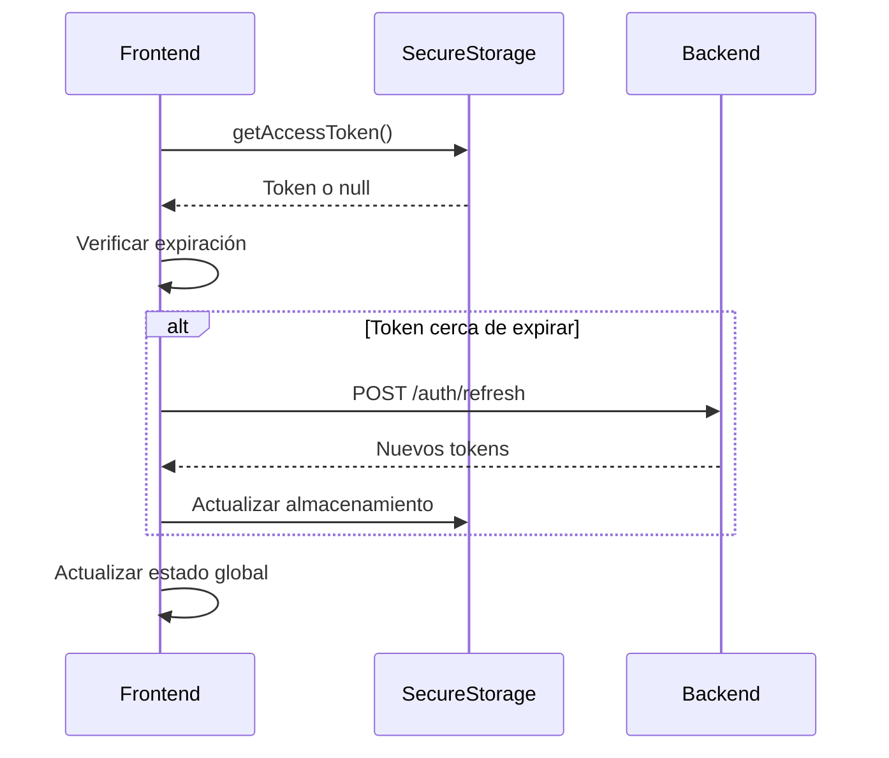

# ✅ IMPLEMENTACIÓN COMPLETA - Documentación del Flujo de Autenticación Google Sign-In

## 🎯 ESTADO: IMPLEMENTACIÓN COMPLETADA

### ✅ Fases Completadas:

- [x] **Fase 1**: Instalación de dependencias
- [x] **Fase 2**: Configuración backend (Google Auth Service, DTOs, Endpoints)
- [x] **Fase 3**: Configuración frontend (Google SDK, Services, API integration)
- [x] **Fase 4**: Integración de UI (Login y Register screens)
- [x] **Fase 5**: Configuración de proyecto (Environment variables, app.json, Google services)
- [x] **Fase 6**: Testing setup y documentación

### 📋 Archivos de Configuración Listos:

- `GOOGLE_CONSOLE_SETUP.md` - Guía completa para configurar Google Cloud Console
- `TESTING_GOOGLESIGNIN.md` - Script completo de testing y validación
- Archivos placeholder para `google-services.json` y `GoogleService-Info.plist`

### 🔧 Próximos Pasos:

1. **Configurar Google Cloud Console** siguiendo `GOOGLE_CONSOLE_SETUP.md`
2. **Reemplazar variables de entorno** con valores reales
3. **Descargar archivos de configuración** reales de Google Console
4. **Ejecutar tests** usando `TESTING_GOOGLESIGNIN.md`

---

# Documentación del Flujo de Autenticación Actual (Backend y Frontend)

Este documento describe el sistema de autenticación completo de la aplicación ProyectoGlobales, que utiliza una arquitectura multi-tenant donde un `User` global puede tener perfiles específicos (`UserBrand`) para diferentes marcas.

## Resumen del Sistema

### Arquitectura Multi-Tenant

El sistema implementa una arquitectura multi-tenant con los siguientes elementos clave:

1. **User**: Usuario global identificado por un email único en toda la plataforma
2. **Brand**: Representación de una marca/negocio en el sistema
3. **UserBrand**: Relación específica entre un usuario y una marca, incluyendo credenciales específicas para esa marca

### Flujo de Autenticación Actual

El proceso de autenticación se basa en JWT tokens y sigue este flujo:

1. **Validación de Credenciales**: El usuario proporciona email y contraseña
2. **Verificación Multi-Tenant**: El sistema busca al usuario y su relación con la marca específica
3. **Generación de Tokens**: Se crean tokens JWT con información del usuario y la marca
4. **Sesión Perpetua Opcional**: Si se selecciona "Remember Me", se genera un refresh token sin expiración

## Componentes Backend

### 1. Modelo de Datos (Prisma Schema)

```typescript
// Usuario global (único por email)
model User {
  id                 Int                 @id @default(autoincrement())
  email              String              @unique
  username           String              @unique
  firstName          String
  lastName           String?
  phone              String?
  role               UserRole            @default(CLIENT)
  userBrands         UserBrand[]         // Relaciones con marcas
  // ... otros campos
}

// Marca/Negocio
model Brand {
  id                  Int                  @id @default(autoincrement())
  name                String
  ownerId             Int
  userBrands          UserBrand[]
  // ... otros campos
}

// Relación específica Usuario-Marca con credenciales propias
model UserBrand {
  id           Int      @id @default(autoincrement())
  passwordHash String   // Contraseña específica para esta marca
  salt         String   @unique
  userId       Int
  brandId      Int
  user         User     @relation(fields: [userId], references: [id])
  brand        Brand    @relation(fields: [brandId], references: [id])
  @@unique([userId, brandId])
}
```

### 2. AuthService (Backend)

**Responsabilidad**: Manejar toda la lógica de autenticación multi-tenant.

#### Funciones Clave:

##### `registerClient(registerDto: RegisterClientDto)`

- **Flujo**:
  1. Valida username (único globalmente) y contraseña
  2. Verifica que la marca existe
  3. Comprueba si el email ya está registrado en esa marca específica
  4. Si el usuario global no existe, lo crea
  5. Crea la relación `UserBrand` con credenciales específicas
  6. Genera JWT token con información de user, brand y userBrand

```typescript
const tokenPayload = {
  userId: user.id,
  userBrandId: userBrand.id,
  brandId: registerDto.branchId,
  email: user.email,
  username: user.username,
  role: user.role,
};
```

##### `login(loginDto: LoginRequestDto)`

- **Flujo**:
  1. Busca usuario por email globalmente
  2. Verifica que tiene una relación activa con la marca específica
  3. Valida la contraseña específica de esa marca
  4. Genera access token (8 horas) y opcionalmente refresh token (sin expiración)
  5. Si `rememberMe` es true, crea sesión perpetua

### 3. AuthController (Backend)

**Endpoints disponibles**:

- `POST /auth/register/client` - Registro de cliente en marca específica
- `POST /auth/login` - Login con email/contraseña
- `POST /auth/refresh` - Renovación de tokens
- `POST /auth/forgot-password` - Solicitar reset de contraseña
- `POST /auth/validate-reset-code` - Validar código de reset
- `POST /auth/reset-password` - Cambiar contraseña
- `GET /auth/profile` - Obtener perfil del usuario autenticado
- `PUT /auth/profile` - Actualizar perfil del usuario

### 4. Validación de Disponibilidad

El sistema incluye validación en tiempo real de:

#### Email (`ValidateService.validateEmail`)

- **Validación Global**: Para roles ROOT/ADMIN - email único en toda la plataforma
- **Validación por Marca**: Para clientes - permite mismo email en diferentes marcas

#### Username (`ValidateService.validateUsername`)

- **Únicamente Global**: Username debe ser único en toda la plataforma

### 5. JWT Strategy

```typescript
// Payload del JWT incluye información multi-tenant
async validate(payload: any) {
  return {
    userId: payload.userId,
    userBrandId: payload.userBrandId, // Relación específica
    brandId: payload.brandId,         // Marca actual
    email: payload.email,
    username: payload.username,
    role: payload.role
  };
}
```

## Componentes Frontend

### 1. AuthService (Frontend)

**Responsabilidad**: Interfaz con el backend y gestión local de tokens.

#### Funciones Clave:

##### `register(data: RegisterFormData)`

- Prepara datos incluyendo `branchId` automáticamente desde la configuración
- Valida campos obligatorios (firstName, lastName)
- Llama al endpoint `/auth/register/client`

##### `login(data: LoginFormData)`

- Autentica con email/contraseña y `rememberMe`
- Almacena tokens según el tipo de sesión
- Inicia auto-renovación para sesiones perpetuas

##### Gestión de Sesiones Perpetuas:

```typescript
// Auto-renovación cada 6 horas para sesiones "Remember Me"
private startTokenAutoRenewal(): void {
  this.refreshInterval = setInterval(async () => {
    const hasRefreshToken = await secureStorage.hasRefreshToken();
    if (hasRefreshToken) {
      await this.autoRefreshToken();
    }
  }, 21600000); // 6 horas
}
```

### 2. Almacenamiento Seguro (SecureStorage)

**Estrategia Multi-Plataforma**:

- **Web**: localStorage para sesiones perpetuas, sessionStorage para temporales
- **Mobile**: AsyncStorage (con upgrade futuro a SecureStore)

#### Gestión de Tokens:

```typescript
// Almacenamiento según tipo de sesión
async storeAccessToken(token: string, rememberMe: boolean = false) {
  const storage = rememberMe ? this.persistentStorage : this.sessionStorage;
  await storage.setItem('access_token', token);
}

// Refresh tokens siempre persistentes
async storeRefreshToken(token: string) {
  await this.persistentStorage.setItem('refresh_token', token);
}
```

### 3. Contexto de Aplicación (AppContext)

**Responsabilidad**: Estado global de autenticación y auto-verificación.

#### Características:

- **Auto-verificación**: Al iniciar la app, verifica tokens existentes
- **Auto-login**: Si hay sesión válida, restaura automáticamente
- **Mapeo de Datos**: Convierte datos del backend al formato del contexto

```typescript
// Auto-verificación al iniciar
useEffect(() => {
  checkAuthStatus();
}, []);

const checkAuthStatus = async () => {
  const isAuth = await authService.isAuthenticated();
  if (isAuth) {
    const userData = await authService.getCurrentUser();
    // Mapear datos y actualizar contexto
  }
};
```

### 4. Pantallas de Autenticación

#### Login (`login.tsx`)

- **Validación en tiempo real** con debounce
- **Animaciones fluidas** con Animated API
- **Gestión de errores** específicos por tipo
- **Navegación automática** según rol del usuario

#### Register (`register.tsx`)

- **Validación asíncrona** de email y username
- **Indicadores de fortaleza** de contraseña
- **Validación de términos** y condiciones
- **Feedback visual** de disponibilidad

## Flujo de Datos Completo

### 1. Registro de Cliente



### 2. Login de Usuario



### 3. Verificación de Autenticación



## Características Distintivas

### 1. Multi-Tenant por Diseño

- Un usuario puede tener diferentes credenciales para diferentes marcas
- Cada marca mantiene su propia base de clientes
- Validación de email permite reutilización entre marcas

### 2. Sesiones Flexibles

- **Temporales**: Solo access token, expira con la sesión del navegador
- **Perpetuas**: Access token + refresh token sin expiración
- **Auto-renovación**: Proceso transparente cada 6 horas

### 3. Validación Inteligente

- **Email**: Global para admins, por marca para clientes
- **Username**: Siempre único globalmente
- **Tiempo real**: Feedback inmediato durante el registro

### 4. Seguridad por Capas

- Contraseñas hasheadas con salt único por UserBrand
- JWT con información específica de relación usuario-marca
- Almacenamiento diferenciado según tipo de sesión

## Estado Actual vs. Google Sign-In

### Implementación Actual

- ✅ Autenticación con email/contraseña completa
- ✅ Sistema multi-tenant funcional
- ✅ Sesiones perpetuas implementadas
- ✅ Validación en tiempo real
- ✅ Auto-renovación de tokens

### Para Implementar Google Sign-In

- ❌ No hay integración con Google OAuth
- ❌ No hay endpoints para validación de Google ID Token
- ❌ No hay manejo de cuentas sociales en el frontend
- ❌ No hay fusión de cuentas existentes con Google

### Próximos Pasos para Google Sign-In

1. **Backend**: Agregar endpoint `/auth/google/validate` para procesar ID tokens
2. **Backend**: Integrar Google Auth SDK para verificación de tokens
3. **Frontend**: Implementar `@react-native-google-signin/google-signin`
4. **Frontend**: Crear servicio `googleAuth.native.service.ts`
5. **Lógica**: Manejar fusión con cuentas existentes por email
6. **UI**: Actualizar botones sociales para ser funcionales

## Plan de Implementación de Google Sign-In

### Fase 1: Configuración Inicial

#### 1.1 Instalar Dependencias Backend

```bash
# En el directorio backend
cd backend; npm install google-auth-library
```

#### 1.2 Instalar Dependencias Frontend

```bash
# En el directorio frontend
cd frontend; npm install @react-native-google-signin/google-signin
```

#### 1.3 Configuración de Google Cloud Console

1. **Crear proyecto en Google Cloud Console** (si no existe)
2. **Habilitar Google Sign-In API**
3. **Configurar OAuth 2.0 credentials**:
   - Web client ID (para el backend)
   - Android client ID
   - iOS client ID
4. **Configurar dominios autorizados**

### Fase 2: Implementación Backend

#### 2.1 Crear DTO para Google Authentication

```bash
# Crear archivo en backend/src/auth/dto/google-validate.dto.ts
```

**Contenido del archivo**:

```typescript
import { ApiProperty } from "@nestjs/swagger";
import { IsString, IsNotEmpty, IsOptional, IsBoolean } from "class-validator";

export class GoogleValidateDto {
  @ApiProperty({
    example: "eyJhbGciOiJSUzI1NiIs...",
    description: "Google ID Token obtenido del SDK",
  })
  @IsString({ message: "ID Token debe ser texto" })
  @IsNotEmpty({ message: "ID Token es requerido" })
  idToken: string;

  @ApiProperty({
    example: 1,
    description: "ID de la marca donde se registra el usuario",
  })
  @IsNotEmpty({ message: "Brand ID es requerido" })
  brandId: number;

  @ApiProperty({
    example: false,
    description: "Si debe recordar la sesión indefinidamente",
    required: false,
    default: false,
  })
  @IsOptional()
  @IsBoolean({ message: "RememberMe debe ser verdadero o falso" })
  rememberMe?: boolean = false;
}
```

#### 2.2 Crear Servicio de Google Auth

```bash
# Crear archivo en backend/src/auth/services/google-auth.service.ts
```

**Contenido del archivo**:

```typescript
import { Injectable } from "@nestjs/common";
import { ConfigService } from "@nestjs/config";
import { OAuth2Client } from "google-auth-library";

export interface GoogleUserInfo {
  email: string;
  firstName: string;
  lastName: string;
  picture?: string;
  googleId: string;
}

@Injectable()
export class GoogleAuthService {
  private client: OAuth2Client;

  constructor(private configService: ConfigService) {
    const clientId = this.configService.get<string>("GOOGLE_CLIENT_ID");
    this.client = new OAuth2Client(clientId);
  }

  async verifyIdToken(idToken: string): Promise<GoogleUserInfo | null> {
    try {
      console.log("🔍 Verificando Google ID Token...");

      const ticket = await this.client.verifyIdToken({
        idToken,
        audience: this.configService.get<string>("GOOGLE_CLIENT_ID"),
      });

      const payload = ticket.getPayload();

      if (!payload) {
        console.log("❌ Token payload vacío");
        return null;
      }

      console.log("✅ Token verificado exitosamente");
      console.log("📧 Email:", payload.email);
      console.log("👤 Nombre:", payload.given_name, payload.family_name);

      return {
        email: payload.email!,
        firstName: payload.given_name || "",
        lastName: payload.family_name || "",
        picture: payload.picture,
        googleId: payload.sub,
      };
    } catch (error) {
      console.error("❌ Error verificando ID Token:", error);
      return null;
    }
  }
}
```

#### 2.3 Actualizar AuthService

Agregar método `loginWithGoogle` al AuthService existente:

```typescript
// En backend/src/auth/auth.service.ts
async loginWithGoogle(googleValidateDto: GoogleValidateDto): Promise<BaseResponseDto<AuthResponse>> {
  console.log('\n🔍 === GOOGLE LOGIN INICIADO ===');
  console.log('🏢 BrandId:', googleValidateDto.brandId);
  console.log('🔒 Remember Me:', googleValidateDto.rememberMe);

  const errors: ErrorDetail[] = [];

  try {
    // Verificar Google ID Token
    const googleUser = await this.googleAuthService.verifyIdToken(googleValidateDto.idToken);

    if (!googleUser) {
      errors.push({
        code: ERROR_CODES.INVALID_CREDENTIALS,
        description: 'Token de Google inválido'
      });
      return BaseResponseDto.error(errors);
    }

    console.log('📧 Google Email:', googleUser.email);

    // Verificar que la marca existe
    const brand = await this.prisma.brand.findUnique({
      where: { id: googleValidateDto.brandId },
      select: { id: true, name: true }
    });

    if (!brand) {
      errors.push({
        code: ERROR_CODES.BRAND_NOT_FOUND,
        description: 'Marca no encontrada'
      });
      return BaseResponseDto.error(errors);
    }

    // Buscar usuario existente por email
    let user = await this.prisma.user.findUnique({
      where: { email: googleUser.email },
      include: {
        userBrands: {
          where: { brandId: googleValidateDto.brandId }
        }
      }
    });

    // Si el usuario no existe, crearlo
    if (!user) {
      console.log('👤 Creando nuevo usuario desde Google...');

      // Generar username único basado en email
      const baseUsername = googleUser.email.split('@')[0];
      let username = baseUsername;
      let counter = 1;

      while (await this.prisma.user.findUnique({ where: { username } })) {
        username = `${baseUsername}${counter}`;
        counter++;
      }

      user = await this.prisma.user.create({
        data: {
          email: googleUser.email,
          username,
          firstName: googleUser.firstName,
          lastName: googleUser.lastName,
          role: 'CLIENT'
        },
        include: {
          userBrands: {
            where: { brandId: googleValidateDto.brandId }
          }
        }
      });

      console.log('✅ Usuario creado:', user.id);
    }

    // Verificar si ya tiene UserBrand para esta marca
    let userBrand = user.userBrands[0];

    if (!userBrand) {
      console.log('🔗 Creando relación UserBrand...');

      // Para usuarios de Google, crear UserBrand sin contraseña tradicional
      // Usar un hash especial que indique que es cuenta de Google
      const googleAccountHash = await bcrypt.hash(`google_${googleUser.googleId}`, 12);
      const salt = randomBytes(32).toString('hex');

      userBrand = await this.prisma.userBrand.create({
        data: {
          userId: user.id,
          brandId: googleValidateDto.brandId,
          passwordHash: googleAccountHash,
          salt,
        }
      });

      console.log('✅ UserBrand creado para Google user');
    }

    // Generar tokens JWT
    const tokenPayload = {
      userId: user.id,
      userBrandId: userBrand.id,
      brandId: googleValidateDto.brandId,
      email: user.email,
      username: user.username,
      role: user.role,
    };

    const accessToken = createAccessToken(tokenPayload);
    let refreshToken: string | undefined;

    if (googleValidateDto.rememberMe) {
      refreshToken = createRefreshToken(tokenPayload);
      console.log('🔄 Refresh token generado para sesión perpetua');
    }

    const response: AuthResponse = {
      user: {
        id: user.id,
        email: user.email,
        username: user.username,
        firstName: user.firstName || '',
        lastName: user.lastName || '',
        phone: user.phone || '',
        role: user.role,
      },
      brand: {
        id: brand.id,
        name: brand.name,
      },
      token: accessToken,
      refreshToken,
      rememberMe: googleValidateDto.rememberMe || false,
    };

    console.log('🎉 Google login exitoso');
    return BaseResponseDto.success(response);

  } catch (error) {
    console.error('💥 Error en loginWithGoogle:', error);
    errors.push({
      code: ERROR_CODES.INTERNAL_ERROR,
      description: 'Error interno durante autenticación con Google'
    });
    return BaseResponseDto.error(errors);
  }
}
```

#### 2.4 Actualizar AuthController

Agregar endpoint para Google authentication:

```typescript
// En backend/src/auth/auth.controller.ts
@Public()
@Post('google/validate')
@HttpCode(HttpStatus.OK)
@ApiOperation({ summary: 'Autenticar con Google ID Token' })
@ApiBody({ type: GoogleValidateDto })
@ApiResponse({
  status: 200,
  description: 'Autenticación con Google exitosa',
  type: BaseResponseDto<AuthResponse>
})
@ApiResponse({
  status: 401,
  description: 'Token de Google inválido'
})
async validateGoogleToken(
  @Body(ValidationPipe) googleValidateDto: GoogleValidateDto
): Promise<BaseResponseDto<AuthResponse>> {
  return this.authService.loginWithGoogle(googleValidateDto);
}
```

#### 2.5 Actualizar AuthModule

```typescript
// En backend/src/auth/auth.module.ts
import { GoogleAuthService } from "./services/google-auth.service";

@Module({
  imports: [
    PrismaModule,
    CommonModule,
    PassportModule,
    JwtModule.register({
      secret: process.env.JWT_SECRET || "default-secret-key",
      signOptions: { expiresIn: "8h" },
    }),
  ],
  controllers: [AuthController],
  providers: [
    AuthService,
    GoogleAuthService, // Agregar aquí
    JwtStrategy,
    CryptoService,
  ],
  exports: [AuthService, GoogleAuthService],
})
export class AuthModule {}
```

#### 2.6 Variables de Entorno

Agregar en `.env`:

```bash
# Google OAuth Configuration
GOOGLE_CLIENT_ID=tu_google_client_id_aqui
```

### Fase 3: Implementación Frontend

#### 3.1 Configuración Google Sign-In

```bash
# Crear archivo de configuración en frontend/src/config/googleAuth.config.ts
```

**Contenido del archivo**:

```typescript
import { Platform } from "react-native";
import Constants from "expo-constants";

export const GoogleAuthConfig = {
  webClientId:
    Constants.expoConfig?.extra?.googleWebClientId ||
    process.env.EXPO_PUBLIC_GOOGLE_WEB_CLIENT_ID,
  androidClientId:
    Constants.expoConfig?.extra?.googleAndroidClientId ||
    process.env.EXPO_PUBLIC_GOOGLE_ANDROID_CLIENT_ID,
  iosClientId:
    Constants.expoConfig?.extra?.googleIosClientId ||
    process.env.EXPO_PUBLIC_GOOGLE_IOS_CLIENT_ID,
  scopes: ["email", "profile"],
};

export const getGoogleClientId = (): string => {
  if (Platform.OS === "android") {
    return GoogleAuthConfig.androidClientId;
  } else if (Platform.OS === "ios") {
    return GoogleAuthConfig.iosClientId;
  } else {
    return GoogleAuthConfig.webClientId;
  }
};
```

#### 3.2 Crear Servicio Google Auth Nativo

```bash
# Crear archivo en frontend/src/services/googleAuth.native.service.ts
```

**Contenido del archivo**:

```typescript
import {
  GoogleSignin,
  statusCodes,
} from "@react-native-google-signin/google-signin";
import { GoogleAuthConfig } from "../config/googleAuth.config";

export interface GoogleSignInResult {
  success: boolean;
  idToken?: string;
  user?: {
    email: string;
    name: string;
    photo?: string;
    familyName?: string;
    givenName?: string;
  };
  error?: string;
}

class GoogleAuthNativeService {
  private isConfigured = false;

  constructor() {
    this.configure();
  }

  private configure(): void {
    try {
      GoogleSignin.configure({
        webClientId: GoogleAuthConfig.webClientId,
        offlineAccess: true,
        hostedDomain: "",
        loginHint: "",
        forceCodeForRefreshToken: true,
        accountName: "",
        iosClientId: GoogleAuthConfig.iosClientId,
        googleServicePlistPath: "",
        openIdRealm: "",
        profileImageSize: 120,
      });

      this.isConfigured = true;
      console.log("✅ Google Sign-In configurado correctamente");
    } catch (error) {
      console.error("❌ Error configurando Google Sign-In:", error);
    }
  }

  async signIn(): Promise<GoogleSignInResult> {
    try {
      if (!this.isConfigured) {
        this.configure();
      }

      console.log("🔍 Iniciando Google Sign-In...");

      // Verificar si Google Play Services están disponibles (Android)
      await GoogleSignin.hasPlayServices();

      // Realizar sign in
      const userInfo = await GoogleSignin.signIn();

      console.log("✅ Google Sign-In exitoso");
      console.log("📧 Email:", userInfo.user.email);
      console.log("👤 Nombre:", userInfo.user.name);

      // Obtener ID Token
      const tokens = await GoogleSignin.getTokens();

      return {
        success: true,
        idToken: tokens.idToken,
        user: {
          email: userInfo.user.email,
          name: userInfo.user.name || "",
          photo: userInfo.user.photo || undefined,
          familyName: userInfo.user.familyName || undefined,
          givenName: userInfo.user.givenName || undefined,
        },
      };
    } catch (error: any) {
      console.error("❌ Error en Google Sign-In:", error);

      let errorMessage = "Error desconocido en Google Sign-In";

      if (error.code === statusCodes.SIGN_IN_CANCELLED) {
        errorMessage = "Sign-in cancelado por el usuario";
      } else if (error.code === statusCodes.IN_PROGRESS) {
        errorMessage = "Sign-in en progreso";
      } else if (error.code === statusCodes.PLAY_SERVICES_NOT_AVAILABLE) {
        errorMessage = "Google Play Services no disponible";
      } else {
        errorMessage = error.message || errorMessage;
      }

      return {
        success: false,
        error: errorMessage,
      };
    }
  }

  async signOut(): Promise<void> {
    try {
      await GoogleSignin.signOut();
      console.log("✅ Google Sign-Out exitoso");
    } catch (error) {
      console.error("❌ Error en Google Sign-Out:", error);
    }
  }

  async isSignedIn(): Promise<boolean> {
    return GoogleSignin.isSignedIn();
  }

  async getCurrentUser(): Promise<any> {
    try {
      return await GoogleSignin.getCurrentUser();
    } catch (error) {
      return null;
    }
  }
}

export const googleAuthNativeService = new GoogleAuthNativeService();
```

#### 3.3 Actualizar AuthService Frontend

Agregar método para login con Google:

```typescript
// En frontend/src/services/authService.ts
async loginWithGoogle(idToken: string, rememberMe: boolean = false): Promise<AuthResponse> {
  try {
    console.log('🔍 Login con Google iniciado');

    const response = await fetch(`${this.baseURL}/auth/google/validate`, {
      method: 'POST',
      headers: {
        'Content-Type': 'application/json',
      },
      body: JSON.stringify({
        idToken,
        brandId: getBrandId(),
        rememberMe,
      }),
    });

    if (!response.ok) {
      const errorData = await response.json().catch(() => ({}));
      throw new Error(errorData.message || 'Google authentication failed');
    }

    const result = await response.json();

    if (!result.success || !result.data) {
      throw new Error(result.errors?.[0]?.description || 'Google login failed');
    }

    const authData: AuthResponse = {
      user: result.data.user,
      brand: result.data.brand,
      token: result.data.token,
      refreshToken: result.data.refreshToken,
      rememberMe: result.data.rememberMe || false,
    };

    console.log('✅ Google login exitoso');

    // Almacenar tokens y datos
    await secureStorage.storeAccessToken(authData.token, authData.rememberMe);
    await secureStorage.storeRememberMe(authData.rememberMe);
    await secureStorage.storeUserData({
      user: authData.user,
      brand: authData.brand,
    }, authData.rememberMe);

    // Almacenar refresh token si existe
    if (authData.refreshToken) {
      await secureStorage.storeRefreshToken(authData.refreshToken);
      this.startTokenAutoRenewal();
      console.log('🔄 Auto-renovación iniciada para Google login');
    }

    return authData;
  } catch (error: any) {
    console.error('❌ Error en loginWithGoogle:', error);
    throw error;
  }
}
```

#### 3.4 Actualizar Endpoints Frontend

```typescript
// En frontend/src/api/endpoints.ts
export const validateGoogleToken = async (data: {
  idToken: string;
  brandId: number;
  rememberMe?: boolean;
}): Promise<AuthResponse> => {
  return apiRequest<AuthResponse>(
    API_ENDPOINTS.AUTH.GOOGLE_VALIDATE,
    "POST",
    data,
    false // No requiere autenticación
  );
};
```

```typescript
// En frontend/src/api/constants.ts
export const API_ENDPOINTS = {
  AUTH: {
    LOGIN: "/auth/login",
    REGISTER: "/auth/register/client",
    REFRESH: "/auth/refresh",
    GOOGLE_VALIDATE: "/auth/google/validate", // Agregar esta línea
    FORGOT_PASSWORD: "/auth/forgot-password",
    VALIDATE_RESET_CODE: "/auth/validate-reset-code",
    RESET_PASSWORD: "/auth/reset-password",
  },
  // ... otros endpoints
};
```

### Fase 4: Actualizar UI

#### 4.1 Actualizar Login Screen

```typescript
// En frontend/src/app/(auth)/login.tsx
import { googleAuthNativeService } from "@/services/googleAuth.native.service";
import { useApp } from "@/contexts/AppContext";

// Agregar esta función dentro del componente LoginScreen
const handleGoogleLogin = async () => {
  try {
    console.log("🔍 Iniciando Google Sign-In...");

    const result = await googleAuthNativeService.signIn();

    if (!result.success) {
      showToast(result.error || "Google sign-in failed", "error", "high");
      return;
    }

    if (!result.idToken) {
      showToast("No se pudo obtener el token de Google", "error", "high");
      return;
    }

    console.log("🔑 Token obtenido, autenticando con backend...");

    // Usar el AuthService para autenticar con el backend
    const authResponse = await authService.loginWithGoogle(
      result.idToken,
      rememberMe
    );

    // Actualizar contexto
    const success = await login(authResponse.user.email, ""); // Password no necesario para Google

    if (success) {
      const isAdmin =
        authResponse.user.role === "ADMIN" || authResponse.user.role === "ROOT";

      showSuccess(
        `¡Bienvenido ${result.user?.name || authResponse.user.firstName}!`,
        3000
      );

      setTimeout(() => {
        if (isAdmin) {
          router.replace("/(admin-tabs)/appointments");
        } else {
          router.replace("/(client-tabs)");
        }
      }, 100);
    }
  } catch (error: any) {
    console.error("❌ Error en Google login:", error);

    if (error.message?.includes("cancelled")) {
      showToast("Sign-in cancelado", "info", "medium");
    } else if (error.message?.includes("network")) {
      showToast("Error de conexión. Verifique su internet.", "error", "high");
    } else {
      showToast(error.message || "Error en Google sign-in", "error", "high");
    }
  }
};

// Reemplazar la función handleGoogleLogin existente que muestra "coming soon"
```

#### 4.2 Actualizar Register Screen

```typescript
// En frontend/src/app/(auth)/register.tsx
const handleGoogleSignUp = async () => {
  try {
    console.log("🔍 Iniciando Google Sign-Up...");

    const result = await googleAuthNativeService.signIn();

    if (!result.success) {
      showToast(result.error || "Google sign-up failed", "error", "high");
      return;
    }

    if (!result.idToken) {
      showToast("No se pudo obtener el token de Google", "error", "high");
      return;
    }

    console.log("🔑 Token obtenido, registrando con backend...");

    // Para registro, siempre usar rememberMe false inicialmente
    const authResponse = await authService.loginWithGoogle(
      result.idToken,
      false
    );

    showSuccess(
      `¡Bienvenido ${
        result.user?.name || authResponse.user.firstName
      }! Tu cuenta ha sido creada.`,
      4000
    );

    setTimeout(() => {
      router.replace("/");
    }, 1000);
  } catch (error: any) {
    console.error("❌ Error en Google sign-up:", error);

    if (error.message?.includes("cancelled")) {
      showToast("Sign-up cancelado", "info", "medium");
    } else {
      showToast(error.message || "Error en Google sign-up", "error", "high");
    }
  }
};

// Reemplazar la función handleGoogleSignUp existente
```

### Fase 5: Configuración de Proyecto

#### 5.1 Variables de Entorno Frontend

Agregar en `frontend/.env`:

```bash
# Google OAuth Configuration
EXPO_PUBLIC_GOOGLE_WEB_CLIENT_ID=tu_web_client_id.apps.googleusercontent.com
EXPO_PUBLIC_GOOGLE_ANDROID_CLIENT_ID=tu_android_client_id.apps.googleusercontent.com
EXPO_PUBLIC_GOOGLE_IOS_CLIENT_ID=tu_ios_client_id.apps.googleusercontent.com
```

#### 5.2 Configuración app.json/app.config.js

```json
{
  "expo": {
    "extra": {
      "googleWebClientId": "tu_web_client_id.apps.googleusercontent.com",
      "googleAndroidClientId": "tu_android_client_id.apps.googleusercontent.com",
      "googleIosClientId": "tu_ios_client_id.apps.googleusercontent.com"
    },
    "android": {
      "googleServicesFile": "./google-services.json"
    },
    "ios": {
      "googleServicesFile": "./GoogleService-Info.plist"
    }
  }
}
```

### Fase 6: Testing y Validación

#### 6.1 Test Backend

```bash
# Probar endpoint de Google validation
cd backend; npm run test
```

#### 6.2 Test Frontend

```bash
# Probar integración completa
cd frontend; npm run test
```

#### 6.3 Test de Flujos

1. **Nuevo Usuario con Google**: Verificar creación automática
2. **Usuario Existente**: Verificar login automático
3. **Multi-tenant**: Mismo email Google en diferentes marcas
4. **Tokens**: Verificar generación y almacenamiento
5. **Sesiones Perpetuas**: Verificar Remember Me con Google

### Fase 7: Documentación Final

#### 7.1 Actualizar README

Documentar el nuevo flujo de Google Sign-In incluyendo:

- Configuración necesaria
- Variables de entorno
- Proceso de setup en Google Cloud Console

#### 7.2 Diagramas de Flujo

Crear diagramas actualizados que incluyan:

- Flujo de Google Sign-In para nuevos usuarios
- Flujo de Google Sign-In para usuarios existentes
- Manejo de errores específicos de Google Auth

Este sistema actual proporciona una base sólida para agregar autenticación con Google manteniendo la arquitectura multi-tenant existente.

## Comandos de Implementación Resumidos

### Setup Inicial

```bash
# Backend
cd backend; npm install google-auth-library

# Frontend
cd frontend; npm install @react-native-google-signin/google-signin

# Variables de entorno
# Configurar .env en ambos directorios con los Google Client IDs
```

### Desarrollo

```bash
# Desarrollo backend
cd backend; npm run start:dev

# Desarrollo frontend
cd frontend; npm start

# Testing
cd backend; npm run test
cd frontend; npm run test
```

### Verificación

```bash
# Comprobar funcionamiento del backend
cd backend; curl -X POST http://localhost:3000/auth/google/validate

# Verificar configuración Google
cd frontend; npx react-native info
```
